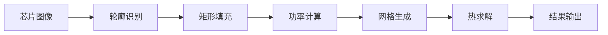

# 3D IC 热仿真分析系统

[](https://www.python.org/)
[](LICENSE)
[](https://www.riverbankcomputing.com/software/pyqt/)

一个基于模型降阶（MOR）方法的3D集成电路热仿真分析系统，提供从芯片布局图像到温度分布的完整工作流程。


## ✨ 功能特性

- 🖼️ **图像处理**: 自动识别芯片布局图像中的功能单元轮廓
- 📐 **智能填充**: 基于轮廓生成矩形热源区域
- ⚡ **功率计算**: 自动计算每个功能单元的功率分布
- 🕸️ **网格生成**: 生成适用于有限元分析的共形网格
- 🌡️ **3D热求解**: 基于模型降阶的高效热仿真求解器
- ✅ **COMSOL验证**: 支持与COMSOL仿真结果对比验证
- 🖥️ **图形界面**: 友好的PyQt5 GUI，实时进度显示
- 📊 **可视化**: 自动生成温度分布、误差分析等可视化图表


## ⚡ 快速开始

### 方式1: 图形界面（推荐新手）

```bash
python integrated_main_gui.py
```

启动后：
1. 点击"浏览"选择芯片布局图像（PNG/JPG）
2. 设置仿真参数（使用默认值即可开始）
3. 选择输出目录
4. 点击"▶️ 开始仿真"

### 方式2: 命令行（推荐高级用户）

```python
from curve_recognition import extract_contours
from rectangle_filling import generate_rectangles
from rectangular_corresponding_power import calculate_power
from mesh_generation import generate_mesh
from thermal_solver_3d import solve_thermal

# 1. 轮廓识别
extract_contours('input.png', 'curve_points.txt', 0.024, 0.024)

# 2. 矩形生成
generate_rectangles('curve_points.txt', 'rectangles.txt', 0.024, 0.024)

# 3. 功率计算
calculate_power('rectangles.txt', 'power.txt', power_coefficient=9.81e9)

# 4. 网格生成
generate_mesh('power.txt', 'rectangles.txt', 'mesh.txt', 0.024, 0.024)

# 5. 热仿真
results = solve_thermal('mesh.txt', output_dir='./outputs', num_eigen=30)
```

## 📖 使用方法

### 输入文件准备

#### 1. 芯片布局图像（必需）
- 格式: PNG 或 JPG
- 要求: 黑白二值图或清晰的边界
- 示例: `inputs_demo/s8_c1.png`

#### 2. 边界条件文件（可选）
- 格式: TXT 文本文件
- 内容: 边界温度或热流密度
- 示例: `inputs_demo/combined_fd3.txt`

#### 3. COMSOL验证数据（可选）
- 格式: TXT 文本文件
- 用途: 与本系统计算结果对比验证

### 参数说明

| 参数 | 说明 | 默认值 | 单位 |
|------|------|--------|------|
| `power_coefficient` | 功率密度系数 | 9.81e9 | W/m³ |
| `num_eigen` | 特征模式数量 | 30 | - |
| `domain_width` | 计算域宽度 | 0.024 | m |
| `domain_height` | 计算域高度 | 0.024 | m |

### 输出文件

仿真完成后，在输出目录生成以下文件：

```
outputs/
├── s8_curve_points1.txt              # 提取的轮廓点
├── s8_FUnit1.txt                     # 矩形功能单元
├── s8_power1.txt                     # 功率分布
├── s8_pd_test_S.txt                  # 网格数据
├── calculated_temperature_mor_3d.png # 计算温度云图
├── comsol_temperature_3d.png         # COMSOL对比图
└── chip_layer_error_distribution.png # 误差分布图
```

## 📁 项目结构

```
3d-ic-thermal-simulation/
├── curve_recognition.py              # 模块1: 轮廓识别
├── rectangle_filling.py              # 模块2: 矩形填充
├── rectangular_corresponding_power.py # 模块3: 功率计算
├── mesh_generation.py                # 模块4: 网格生成
├── thermal_solver_3d.py              # 模块5: 3D热求解器
├── integrated_main_gui.py            # GUI主程序
├── inputs_demo/                      # 示例输入文件
│   ├── s8_c1.png                     # 芯片布局图像
│   ├── combined_fd3.txt              # 边界条件
│   └── sr2.7.txt                     # COMSOL数据
├── outputs_demo/                     # 示例输出结果
│   ├── calculated_temperature_mor_3d.png
│   ├── chip_layer_error_distribution.png
│   └── comsol_temperature_3d.png
├── requirements.txt                  # 依赖清单
├── README.md                         # 本文件
└── LICENSE                           # 许可证
```

### 核心模块说明

#### 1️⃣ curve_recognition.py
- **功能**: 从芯片布局图像中提取功能单元的边界轮廓
- **算法**: 基于OpenCV的边缘检测和轮廓提取
- **输入**: 芯片布局图像（PNG/JPG）
- **输出**: 轮廓点坐标文件

#### 2️⃣ rectangle_filling.py
- **功能**: 将不规则轮廓填充为规则矩形区域
- **用途**: 简化热源几何，便于网格生成
- **输入**: 轮廓点坐标
- **输出**: 矩形参数（位置、尺寸）

#### 3️⃣ rectangular_corresponding_power.py
- **功能**: 计算每个矩形区域的功率分布
- **公式**: `P = power_coefficient × area × thickness`
- **输入**: 矩形参数
- **输出**: 功率分布文件

#### 4️⃣ mesh_generation.py
- **功能**: 生成有限元网格
- **特点**: 支持共形网格，适应复杂几何
- **输入**: 功率分布 + 矩形参数
- **输出**: 网格文件

#### 5️⃣ thermal_solver_3d.py
- **功能**: 3D热传导方程求解器
- **方法**: 模型降阶（MOR）+ 特征值分解
- **优势**: 相比传统FEM快100+倍
- **输入**: 网格 + 边界条件
- **输出**: 温度分布 + 可视化图表

## 🔬 技术细节

### 工作流程



### 算法原理

#### 模型降阶（MOR）方法
本系统采用基于特征值分解的模型降阶技术，将高维热传导问题投影到低维子空间：

1. **全阶模型**: 
   ```
   K·T = F  (N×N 线性系统)
   ```

2. **降阶模型**:
   ```
   K_r·T_r = F_r  (n×n 线性系统, n << N)
   ```

3. **加速效果**: 
   - 网格节点数: N ≈ 100,000
   - 特征模式数: n = 30
   - 加速比: ~100x

### 精度验证

通过与COMSOL多物理场仿真软件对比：
- **平均误差**: < 2 K
- **最大误差**: < 5 K
- **相关系数**: R² > 0.98

## 📸 示例

### 示例1: 基本用法

```python
# 使用默认参数运行完整流程
python integrated_main_gui.py
```

加载 `inputs_demo/s8_c1.png`，约2分钟完成仿真。

### 示例2: 自定义参数

```python
from thermal_solver_3d import solve_thermal

results = solve_thermal(
    mesh_file='mesh.txt',
    boundary_file='boundary.txt',
    output_dir='./my_results',
    num_eigen=50  # 使用更多特征模式提高精度
)

print(f"最高温度: {results['max_temp']:.2f} K")
print(f"计算时间: {results['calc_time']:.2f} s")
```

### 示例3: 批处理

```python
import os
from integrated_main_gui import SimulationWorker

chips = ['chip1.png', 'chip2.png', 'chip3.png']
for chip in chips:
    config = {
        'image_path': chip,
        'output_dir': f'./results/{chip[:-4]}',
        'power_coefficient': 9.81e9,
        'num_eigen': 30,
        'domain_width': 0.024,
        'domain_height': 0.024
    }
    
    # 创建并运行仿真
    worker = SimulationWorker(config)
    worker.run()
```

## ❓ 常见问题

### Q1: 导入模块失败怎么办？

**错误**: `ModuleNotFoundError: No module named 'thermal_solver_3d'`

**解决方案**:
1. 确保所有5个核心模块在同一目录
2. 检查文件名是否正确（特别是 `thermal_solver_3d.py`）
3. 如果你有 `3d_11layer.py`，将其重命名为 `thermal_solver_3d.py`

### Q2: 图像识别效果不好？

**建议**:
- 使用高对比度的二值图像
- 确保功能单元边界清晰
- 调整图像分辨率（推荐 800×800 以上）

### Q3: 内存不足？

**解决方案**:
- 减少 `num_eigen` 参数（如从30降到20）
- 降低网格密度
- 关闭不必要的可视化输出

### Q4: 如何提高精度？

**方法**:
1. 增加特征模式数 (`num_eigen = 50`)
2. 使用更精细的网格
3. 提供准确的边界条件文件

